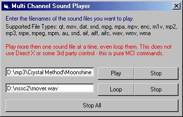



## Multi Channel Sound Playing

### Description

Play as many sounds as you want all at the same time. Supports any file format used by Windows MCI commands. PLEASE read the "Readme.html" file when you download the code.

If you like it - then vote - if you hate it then don't
 
### More Info
 

             |
---                |---
**Submitted On**   |2002-02-08 21:31:14
**By**             |[Bryan A\. Cairns](https://github.com/Planet-Source-Code/PSCIndex/blob/master/ByAuthor/bryan-a-cairns.md)
**Level**          |Beginner
**User Rating**    |5.0 (35 globes from 7 users)
**Compatibility**  |VB 6\.0
**Category**       |[Sound/MP3](https://github.com/Planet-Source-Code/PSCIndex/blob/master/ByCategory/sound-mp3__1-45.md)
**World**          |[Visual Basic](https://github.com/Planet-Source-Code/PSCIndex/blob/master/ByWorld/visual-basic.md)
**Archive File**   |[Multi\_Chan54059282002\.zip](https://github.com/Planet-Source-Code/bryan-a-cairns-multi-channel-sound-playing__1-31626/archive/master.zip)

### API Declarations

Windows MCI Commands - a ton of them

